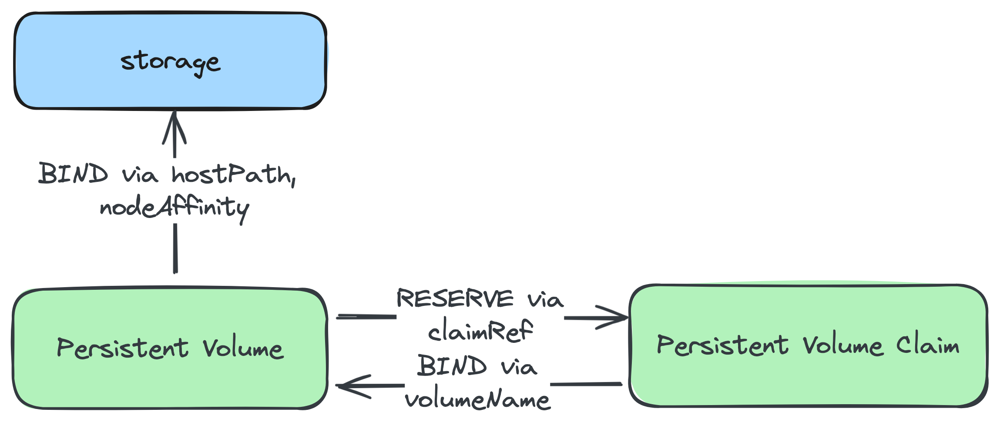

# 기존 storage에 Persistent Volume 연동하기 (w/ 데이터 유지)


## Motivation
storage에 저장된 데이터는 app 또는 cluster의 lifecycle과는 별개로 다룰 필요는 항시 발생하기 마련이다. 이에 대한 구체적 요구사항은 다음이 될 것이다.

- app이 삭제되더라도 데이터는 삭제되지 않도록 함
- 기존 데이터를 신규 app과 cluster에서 사용 가능하도록
이는 StorageClass를 사용할 경우 발생하는 Dynamic provisioning을 그대로 사용해서는 불가능하다.

## Summary
세 가지 entity 간의 binding 즉, 기존 storage와 PV(Persistent Volume) 간 binding, 그리고 PV와 PVC(Persistent Volume Claim) 간 manual binding을 통해 기존 storage 재사용이 가능하다.

## 설명
Summary에서 논한 두 가지 binding에 대한 상세 내용이다.

### 기존 storage와 PV 간 binding

TODO:
[hostPath](https://kubernetes.io/ko/docs/tasks/configure-pod-container/configure-persistent-volume-storage/#%ED%8D%BC%EC%8B%9C%EC%8A%A4%ED%84%B4%ED%8A%B8%EB%B3%BC%EB%A5%A8-%EC%83%9D%EC%84%B1%ED%95%98%EA%B8%B0)

TODO:
[nodeAffinity](https://kubernetes.io/docs/reference/kubernetes-api/config-and-storage-resources/persistent-volume-v1/#PersistentVolumeSpec)


### PV와 PVC와의 binding

> 자세한 내용은 Kubernetes 공식 가이드인 [Reserving a Persistent Volume](https://kubernetes.io/docs/concepts/storage/persistent-volumes/#reserving-a-persistentvolume)를 참조한다.


이를 위해 다음 세 가지를 설정해야 한다.

1. **`spec.storageClassName: ""`**: `""`를 지정하지 않으면 default인 `standard`가 설정된다. PV, PVC 모두에 설정한다.
2. **`spec.volumeName` 설정**: PVC 설정 항목으로서, binding 대상의 PV name을 지정한다.
3. **`spec.claimRef` 설정**: PV 설정 항목으로서, 타 PVC가 binding함을 막기 위함이다.

## 예제
아래는 [`docker-registry`](../apps/docker-registry/) app에서 사용하는 pv, pvc 설정 예이다.

```yaml
apiVersion: v1
kind: PersistentVolume
metadata:
  name: docker-registry
spec:
  storageClassName: ""
  claimRef:
    name: docker-registry
    namespace: cluster
  persistentVolumeReclaimPolicy: Retain
  accessModes:
    - ReadWriteOnce
  capacity:
    storage: 10Gi
  hostPath:
    path: /var/local-path-provisioner/docker-registry
    type: DirectoryOrCreate
  nodeAffinity:
    required:
      nodeSelectorTerms:
        - matchExpressions:
            - key: kubernetes.io/hostname
              operator: In
              values:
                - my-cluster-worker
```

```yaml
apiVersion: v1
kind: PersistentVolumeClaim
metadata:
  name: docker-registry
  namespace: cluster
spec:
  storageClassName: ""
  volumeName: docker-registry
  accessModes:
    - ReadWriteOnce
  resources:
    requests:
      storage: 10Gi
```