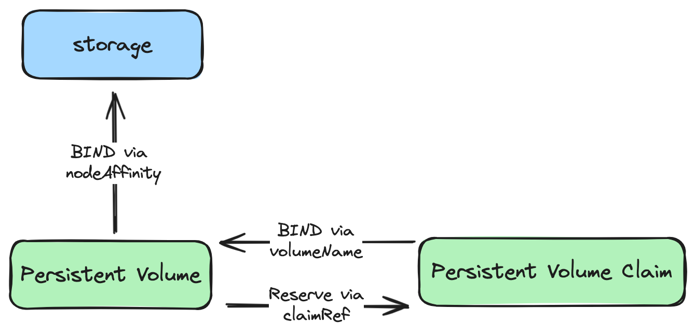

# Reusing Existing Storage in `kind` (with Data Retention)


## Motivation
Data stored in storage often needs to be handled independently of the lifecycle of the app or cluster. For example, when a large number of container images are stored in the [Docker Registry](../apps/docker-registry/) app, there may be times when it's necessary to restart the Docker Registry app or the cluster itself for various reasons, such as memory shortage. The specific requirements to address this issue would be:

1. Ensuring that data is not deleted even if the app is deleted
2. Making the existing data usable in new apps and clusters

The default Storage class (`standard`) used by [`kind`](https://kind.sigs.k8s.io/), [`local-path-provisioner`](https://github.com/rancher/local-path-provisioner), is designed for dynamic provisioning to `hostPath`. Due to this characteristic, it always creates a new PV (Persistent Volume) unless a specific PVC (Persistent Volume Claim) is pre-designated, which contradicts the second requirement. Additionally, this storage class has a default Reclaim policy of `Delete`, meaning that when a PVC is deleted, the associated PV  is also deleted, which contradicts the first requirement.


## Summary
By binding existing storage to a PV (Persistent Volume), binding the PV to a PVC (Persistent Volume Claim), and configuring a pod to use the bound PVC, it's possible to reuse existing storage.

## Description
This section details the two types of bindings discussed in the Summary and the configuration for using the created PVC.

### Binding Between Existing Storage and PV

#### 1. `spec.hostPath` Configuration
Specifies the storage path on the host (corresponding to the node from the pod's perspective). The prefix of this path should match `nodes.extraMounts.containerPath` in [`kind-config.yaml`](../kind-config.yaml) to access the directory outside the cluster, i.e., from the host of the `kind` cluster. `nodes.extraMounts.hostPath` in [`kind-config.yaml`](../kind-config.yaml) represents the path of the directory from an external perspective.

#### 2. `spec.nodeAffinity` Configuration
To prevent pods from being created on a node other than the one where the existing storage is located, thus failing to bind with the existing storage, configure `spec.nodeAffinity`. Without it, if only `hostPath` is set, pods could be created on a different node.

### Binding Between PV and PVC

> For detailed information, refer to the official Kubernetes guide, [Reserving a Persistent Volume](https://kubernetes.io/docs/concepts/storage/persistent-volumes/#reserving-a-persistentvolume).

Configure the following three settings:

1. **`spec.storageClassName: ""`**: If not set to `""`, the default `standard` will be used, triggering dynamic provisioning. Set this for both PV and PVC.
2. **`spec.volumeName` Configuration**: A PVC setting that specifies the name of the PV to bind.
3. **`spec.claimRef` Configuration**: A PV setting that specifies the PVC name and namespace, preventing other PVCs from binding to it.

### PVC Usage Configuration

Finally, configure the pod to use the PVC created through the above procedures. For example, in the case of the [Docker Registry](../apps/docker-registry/), use the `persistence.existingClaim` field in the [helm chart value](../apps/docker-registry/values.yaml) to specify the name of the PVC.

## Example
Below is an example of the PV and PVC configuration used in the [`docker-registry`](../apps/docker-registry/) app, following the above description.


```yaml
apiVersion: v1
kind: PersistentVolume
metadata:
  name: docker-registry
spec:
  storageClassName: "" # To prevent dynamic provisioning
  claimRef:
    name: docker-registry # Set PVC name for reserving
    namespace: cluster # Set PVC namespace for reserving
  persistentVolumeReclaimPolicy: Retain # To prevent Storage Deletion upon PVC Deletion
  accessModes:
    - ReadWriteOnce
  capacity:
    storage: 10Gi
  hostPath:
    path: /var/local-path-provisioner/docker-registry # For binding the PV to storage
    type: DirectoryOrCreate
  nodeAffinity:  # For binding the PV to storage
    required:
      nodeSelectorTerms:
        - matchExpressions:
            - key: kubernetes.io/hostname
              operator: In
              values:
                - my-cluster-worker
```

```yaml
apiVersion: v1
kind: PersistentVolumeClaim
metadata:
  name: docker-registry
  namespace: cluster
spec:
  storageClassName: "" # To prevent dynamic provisioning
  volumeName: docker-registry # For binding the PVC to the PV
  accessModes:
    - ReadWriteOnce
  resources:
    requests:
      storage: 10Gi
```